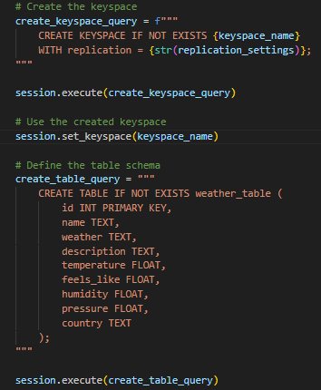
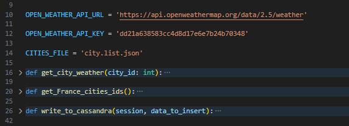
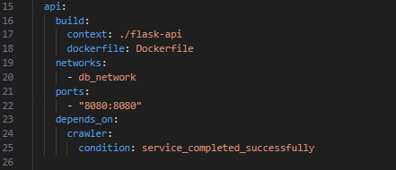
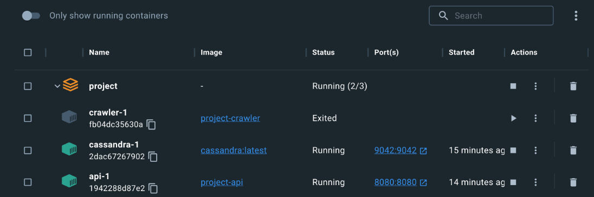

 ## Projet d’exploration de données météorologiques
Ce projet vise à explorer les données météorologiques de l’API OpenWeather https://openweathermap.org pour les villes de France et à stocker les données récupérées dans une base de données Cassandra. Une API est également là pour nous permettre de récupérer des informations météorologiques à partir de la base de données.

Il implémente le pipeline illustré ci-dessous :

! [HomeView] (images/architecture.PNG)

## Project Summary
This initiative encompasses the following key components:

Cassandra Database: A NoSQL database serving as the repository for weather-related data.
Crawler Service: Developed in Python, this service is responsible for acquiring weather data from the OpenWeather API and persisting it within the Cassandra database.
Flask-Api Service: Also built in Python, this service retrieves weather information from the database, responding to API requests.
Docker Compose: An orchestration tool streamlining communication between the Cassandra database and the Crawler service.
Dockerfiles: Definitions for creating Docker containers designed for both Cassandra and the Crawler service.

## Prerequisites
To engage with this project, the following prerequisites are necessary:

  Docker
  Docker Compose
  Components
  Cassandra
Configuration: The Cassandra database is containerized utilizing the official Cassandra Docker image. It's set up to operate on port 9042 and is accessible via the 'cassandra' hostname within the Docker network. A health check feature guarantees that the database is operational before the Crawler commences data insertion.

Initialization: The script init_db.py contains the 'init_db' function, responsible for initializing the Cassandra keyspace and specifying the table schema. This schema includes fields to house various weather attributes like temperature and humidity.

Upon configuring, a keyspace named weather_db and a table named weather_table are established within the Cassandra container. Verification can be conducted using the 'cqlsh' command-line tool.

## Crawler Service
The Crawler service's primary function is to fetch weather data from the OpenWeather API and subsequently insert it into the Cassandra database.

Configuration: The Dockerfile in the 'crawler' directory is responsible for containerizing the Crawler service. This is achieved using a Python 3.6-slim image, ensuring the inclusion of required libraries and scripts in the launched container.

Crawling Logic: The central script, crawler.py, executes the data crawling and insertion into the database. It encompasses several essential functions:

get_city_weather(city_id): Retrieves weather data for a specific city ID from the OpenWeather API via the 'requests' library.
get_France_cities_ids(): Gathers data exclusively for cities located within France, relying on city IDs.
write_to_cassandra(session, data_to_insert): Defines the query responsible for inserting data into the Cassandra database.
HomeView

Once data is crawled from the API, it undergoes a formatting process before being inserted into the database. This is carried out for the first 100 weather records, following which they are added to the table.

Flask API Service
This service focuses on fetching weather data for a particular city based on the provided city name.

Configuration: Similar to the Crawler service, the Flask API service is containerized using a Python 3.6-slim image. It ensures the presence of necessary libraries and scripts in the container. Notably, the API service must wait for the Crawler service to complete its task to prevent connection issues.

Logic: The main.py script within the 'flask-api' folder establishes the API, facilitating the retrieval of weather data for specific cities stored in the Cassandra database. When a client initiates a GET request to the "/weather" endpoint, the API identifies the requested city from the query parameter. Subsequently, it queries the Cassandra database, selecting relevant weather data for the specified city. This data is then processed and transformed into a JSON response, encompassing details such as city name, weather conditions, and temperature. The API leverages Flask's request module to handle incoming requests and the cassandra.cluster module to establish a connection with the Cassandra database. Once the container is up and running, the API is accessible.
HomeView

To test the functionality, a simple request is sent with the desired city name, like "Zutkerque". Subsequently, diverse weather-related information for that city is retrieved.

 

## Execution
To run the project:

Navigate to the project directory via a terminal.
Execute the command docker-compose up to initiate the Cassandra database, Crawler, and Flask API services.

